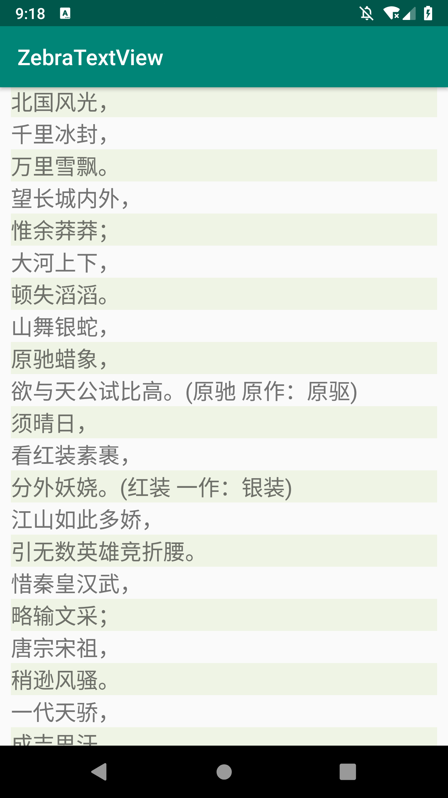

[](https://jitpack.io/#hotstu/ZebraTextView)

# ZebraTextView
Zebra Striped textView/十行代码实现斑马条纹分行


Zebra Striped textView make reading long text Paragraph more comfortable



## How to use

1. Add the JitPack repository to your build file
```
	allprojects {
		repositories {
			...
			maven { url 'https://jitpack.io' }
		}
	}
```
2. Add the dependency
```
	dependencies {
	        implementation 'com.github.hotstu:ZebraTextView:1.0.0'
	}
```

3. use ZebraTextView instead of TextView
you can set the color by xml attribute or programlly
```xml
    <!--
            app:oddLineColor="@color/colorPrimary"
            app:evenLineColor="@color/colorAccent"
    -->
```
or

```java
        ZebraTextView zebraText = findViewById(R.id.text);
        zebraText.setEvenLineColor(Color.WHITE);
        zebraText.setEvenLineColor(Color.BLUE);
```

<br/>

# License

Copyright 2018 hglf

Licensed under the Apache License, Version 2.0 (the "License");
you may not use this file except in compliance with the License.
You may obtain a copy of the License at

    http://www.apache.org/licenses/LICENSE-2.0

Unless required by applicable law or agreed to in writing, software
distributed under the License is distributed on an "AS IS" BASIS,
WITHOUT WARRANTIES OR CONDITIONS OF ANY KIND, either express or implied.
See the License for the specific language governing permissions and
limitations under the License.

<br/>